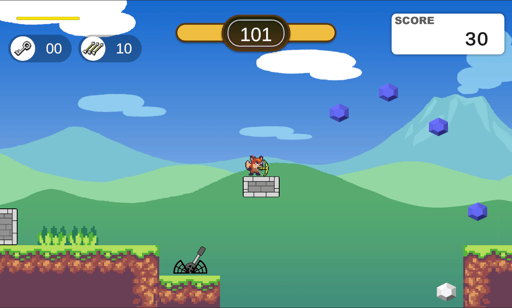
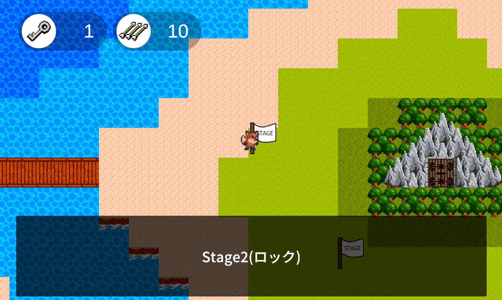
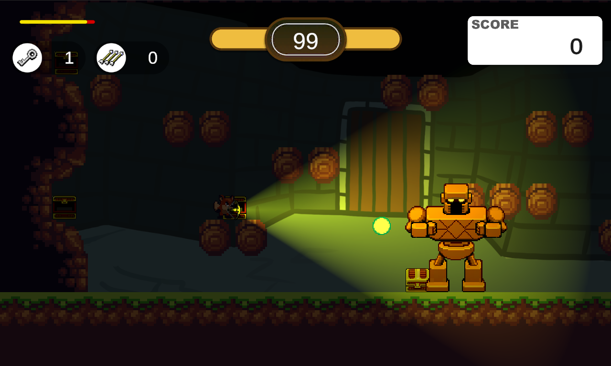

# JewelryHunter_World

## プログラムの場所
* Assets/Scriptsフォルダ・・・各スクリプト

## 作品の概要

### 作品について
Unityで2Dゲーム作成を学ぶにあたって、基本的な機能が網羅されている作品となるよう頑張りました。ワールドマップ上で好きなステージのロックを解除して挑戦できることで、プレイする度に異なる遊び方・攻略の仕方ができるように工夫しました。  
アクションゲームとしての楽しさが出るようにたくさんのギミックをちりばめています。

### 作品の遊び方
タイトル→ワールドマップ→ロックのかかっていないステージ選択  
ステージ中のカギを探す→ワールドマップで捨て０時のロックを解除して攻略  
全部のステージを攻略したらボスステージ解禁→ボス撃破でゲームクリア


ワールドマップ
* 移動：WASDキー/矢印キー/左スティック(ゲームパッド)
* 決定：Space/Enterキー/Eastボタン(ゲームパッド)

ステージマップ
* 移動：ADキー/矢印キー/左スティック(ゲームパッド)
* 決定：Enterキー/Westボタン(ゲームパッド)
* ジャンプ：Spaceキー/Southボタン(ゲームパッド)


## 仕様技術・ツール
* Unity (6000.3.5f2)
* Visual Studio Community 2026 C#
* 利用アセット SunnyLand Artwork
* Sourcetree
* 参考書籍 たのしい2Dゲームの作り方 第3版 Unity 6ではじめるゲーム開発入門 (翔泳社)

## 制作期間
* 2026年2月2日～2026年2月27日

## 制作のポイント
### 異なるゲーム性のブレンド (アクションとワールドマップ)
2Dサイドのアクションと見下ろし型のトップビューという異なるゲーム性のパートを矛盾が無いようにブレンドしています。  
共通する部分と、完全にスクリプトを分ける部分と切り分けて作りました。
* アクションパート専用のUIとPlayerスクリプト  
* ワールドマップ専用のUIとPlayerスクリプト
* 共通するGameManagerやSoundManager  
  
### セーブ機能の実装
ゲームの一定の状態をセーブして続きから遊べるように配慮しました。PlayerPrefsとJSONをうまく活用しています。  
  
SaveDataというシリアライズ化したデータコンテナをSaveDataManagerがJSON化しPlayerPrefsで保存します。  
ほかにもロードや初期化を行うメソッドを用意して、ほかのクラスからも柔軟に呼び出せるようにしています。  

```C#
// SaveManager.csを一部抜粋

// JsonUtility で扱うためのシリアライズ化したクラス
[System.Serializable]
public class SaveData
{
    //略
}

// シリアライズ化したSaveDataクラスを扱っていくマネージャー
public class SaveDataManager : MonoBehaviour
{
    // ゲームデータをPlayerPrefsに保存するメソッド
    public static void SaveGameData()
    {
        // この中でSaveDataクラスをJSON化してPlayerPrefsで保存
    }

    // PlayerPrefsからJSONをロードし、ゲームデータに適用するメソッド
    public static void LoadGameData()
    {
        // この中でPlayerPrefsに保存されていたデータを取得してJSON化を解除、各変数に適用
    }

    // データの初期化
    public static void Initialize()
    {
        // この中でニューゲームした際にPlayerPrefsのデータをクリアし、static変数を初期化
    }
}
```
### ボス戦でのアイテム自動補充
矢の残数がなくなるとシーン上の特定のアイテムのタグ情報を配列に取得し、ランダムなindexに補充の矢を置くように工夫しました。Find命令形でゲームに負荷がかからないように工夫してスクリプトを書きました。  


## 課題
今回はUnityの技術を磨くための作品としてある程度書籍を参考に作り始めました。書籍の内容と自分のアレンジとをツギハギした形となりましたので、ゲームステータスのコントロールや、UIのコントロールが無理やりな部分があったと思います。  
続く作品ではすっきりしたクラス設計となるように計画しながら作れるようになると思います。  

### 今回のゲームをもっと面白くする課題  
* 一般敵の種類を増やす
* チャージショットを打てるようにする
* 探索・収集要素を盛り込んでステージをリピートする楽しさ
* ストーリーパートを導入してユーザーの没入感を高める

## 所感
一つ一つのスクリプトを理解するのに大変でしたが、基礎を構築できたのでもっとゲームをブラッシュアップしたい気持ちや、次のゲームを作る気持ちが強く出ました。  
課題で述べたように模写した内容にツギハギした部分があったので、もっとすっきりしたクラス設計ができるようにコードレビューなどを行なって、今後の成長につなげたいと思う作品です。